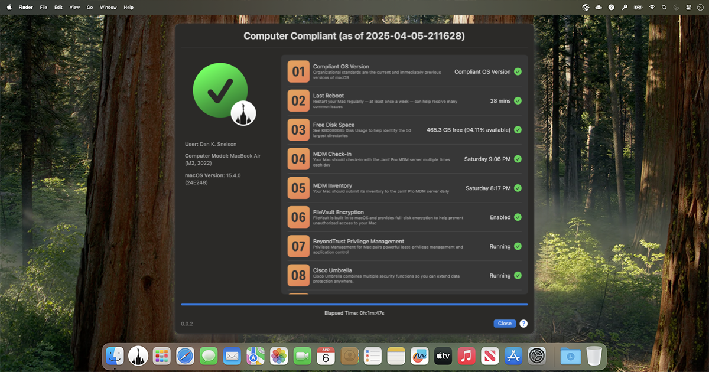

# Computer Compliance with swiftDialog

> Provides users a "heads-up display" of critical computer compliance information via swiftDialog

## Background

More than six years ago, William Smith published Build a Computer Information script for your Help Desk. We implemented a customized version in the fall of that same year.

Last week, after a conversation with one of our rock-star TSRs, we decided it was time for swiftDialog-ized reboot.

## Features

The following compliance checks and information reporting are included in version `1.4.0`, which operates in "test" mode by default. (Change `operationMode` to `production` before deploying in production.)

### Compliance Checks

1. macOS Version
1. Available Updates (including deferred updates)
1. System Integrity Protection
1. Firewall
1. FileVault Encryption
1. Last Reboot
1. Free Disk Space
1. MDM Profile
1. MDM Certificate Expiration
1. Apple Push Notification service
1. Jamf Pro Check-in
1. Jamf Pro Inventory
1. BeyondTrust Privilege Management*
1. Cisco Umbrella*
1. CrowdStrike Falcon*
1. Palo Alto GlobalProtect*
1. Network Quality Test

*[Setup Your Mac Validations](https://github.com/setup-your-mac/Setup-Your-Mac/tree/main/Validations)

### Information Reporting

#### IT Support
- Telephone
- Email
- Website
- Knowledge Base Article

#### User Information
- Full Name
- User Name
- User ID
- Location Services
- Microsoft OneDrive Sync Date
- Platform Single Sign-on Extension

#### Computer Information
- macOS version (and build)
- Computer Name
- Serial Number
- Wi-Fi SSID
- Wi-FI IP Address
- VPN IP Address

#### Jamf Pro Information**
- Site

**[Payload Variables for Configuration Profiles](https://learn.jamf.com/en-US/bundle/jamf-pro-documentation-11.15.0/page/Computer_Configuration_Profiles.html#ariaid-title2)

### Policy Log Reporting

1. Deferred Software Updates
1. Logged-In User Group Membership
1. sudoers
1. Kerberos SSOe
1. Location Services
1. SSH
1. Time Machine
1. Battery Cycle Count
1. Network Time Server
1. Jamf Pro ID

---

## Configuration

[Continue reading …](https://snelson.us/2025/04/computer-compliance-0-0-2/)

---

## Script
- [Computer Compliance with swiftDialog.zsh](Computer%20Compliance%20with%20swiftDialog.zsh)

---

