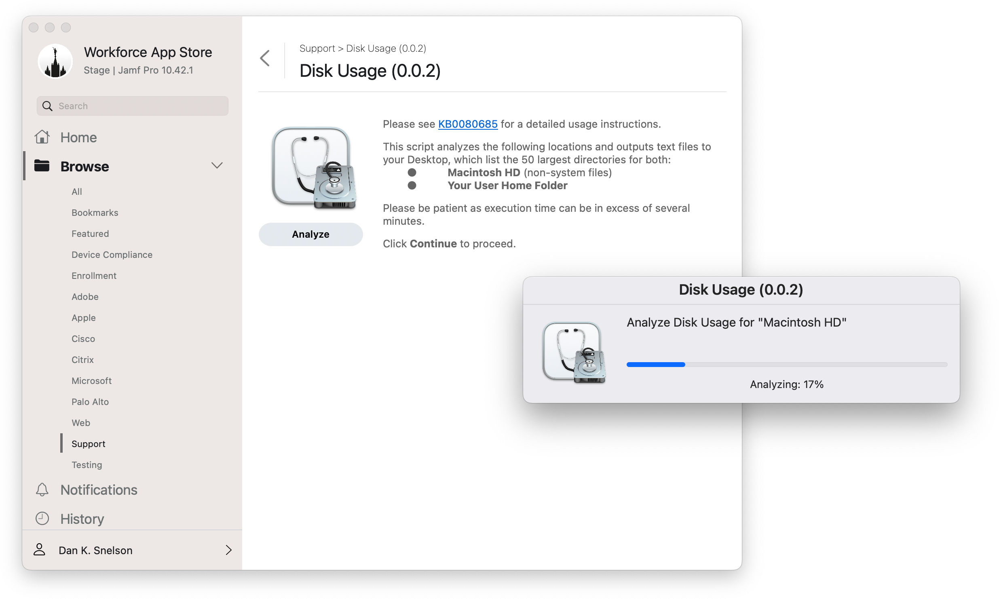

# Disk Usage via swiftDialog

> Help users review their 50 largest directories in preparation to upgrade to macOS Ventura

## Background

To aid users in determining where all their hard drive space has gone, we have a Self Service policy which leverages `du` and outputs text files of the top 50 directories of the root volume and the user's home folder.

The utilitarian results are sorted by size, in gigabytes, and saved to the user's desktop.

[Continue reading …](https://snelson.us/2022/11/disk-usage-with-swiftdialog-0-0-2/)

## Script
- [Disk Usage with swiftDialog.bash](Disk%20Usage%20with%20swiftDialog.bash)