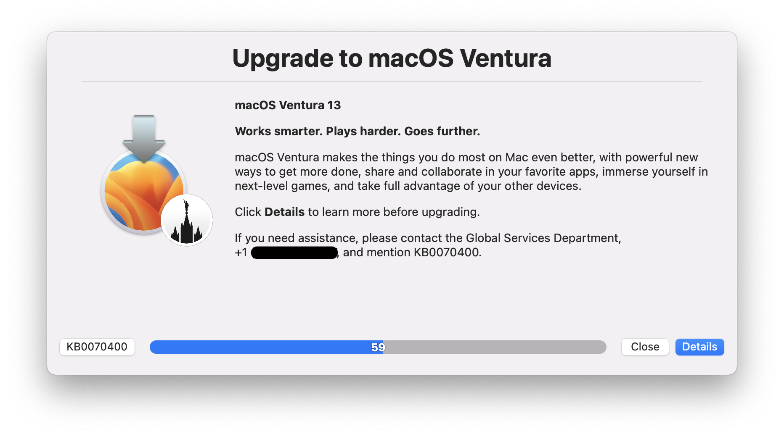

# Display Message via swiftDialog

Leverages [swiftDialog](https://github.com/bartreardon/swiftDialog/releases) and Jamf Pro Policy Script Parameters to display a message to end-users.

[Continue reading …](https://snelson.us/2022/10/display-message-swiftdialog-003/)

## Script
- [Display-Message-via-Dialog.bash](Display-Message-via-Dialog.bash)
