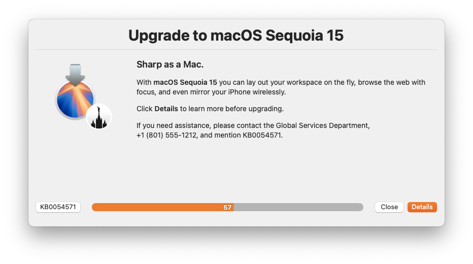
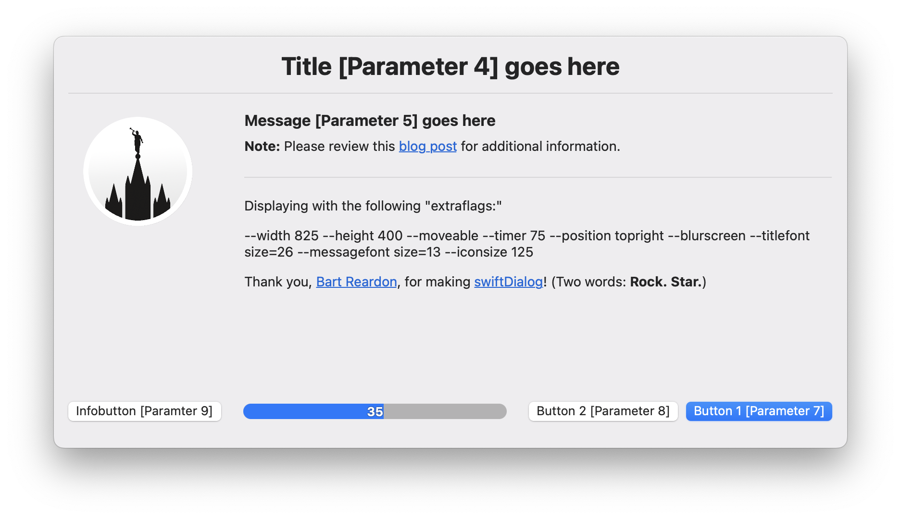

# Display Message via swiftDialog

> Leverage `switftDialog` and Jamf Pro Policy Script Parameters to easily display engaging end-user messages.

## Introduction
Using Bart Reardon's `swiftDialog` and Jamf Pro Policy Script Parameters, creating engaging end-user messages is easy.

[Continue reading …](https://snelson.us/2023/03/display-message-0-0-7-via-swiftdialog/)

### Script
- [Display-Message-via-Dialog.bash](Display-Message-via-Dialog.bash)