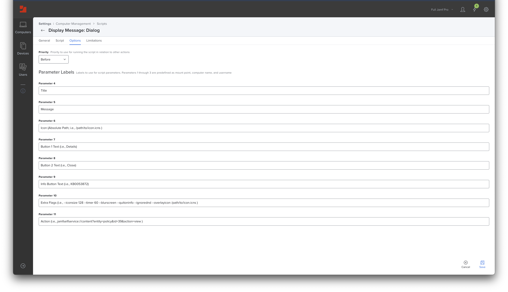
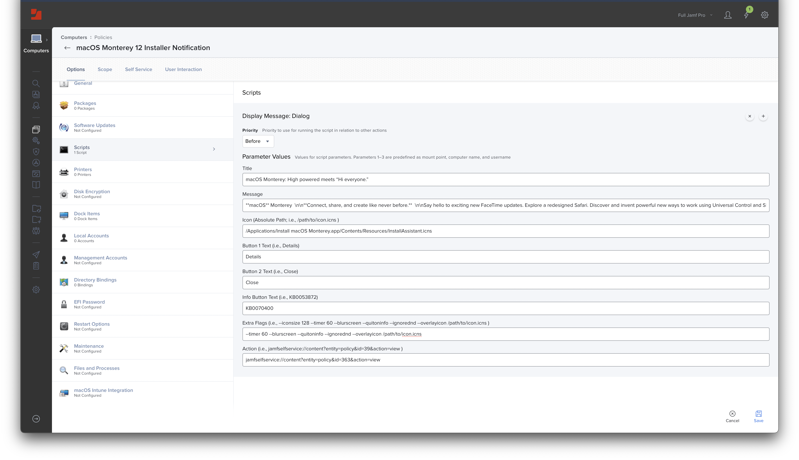

# Display Message via Dialog

Leverages [Dialog](https://github.com/bartreardon/Dialog/releases) v1.9.1+ and Jamf Pro Policy [Script Parameters](https://docs.jamf.com/10.36.0/jamf-pro/documentation/Scripts.html#ID-0002355b) to display a message to end-users.

Based on Bart Reardon (@bartreardon)'s [Example Jamf Scripts](https://github.com/bartreardon/swiftDialog/wiki/Example-Jamf-Scripts).

---

## End-user Example

---

## Jamf Pro Script Options

---

## Jamf Pro Policy Script Payload

- **Title:** `macOS Monterey:** High powered meets “Hi everyone.”`
- **Message:** `**macOS** Monterey  \n\n**Connect, share, and create like never before.**  \n\nSay hello to exciting new FaceTime updates. Explore a redesigned Safari. Discover and invent powerful new ways to work using Universal Control and Shortcuts. Stay in the moment with Focus. And so much more.  \n\nClick **Details** to learn more before upgrading.  \n\nIf you need assistance, please contact the Global Services Department,  \n+1 (801) 555-1212, and mention KB0070400.`
- **Icon:** `/Applications/Install macOS Monterey.app/Contents/Resources/InstallAssistant.icns`
- **Button 1 Text:** `Details` 
- **Button 2 Text:** `Close`
- **Info Button Text:** `KB0070400`
- **Extra Flags:** `--timer 60 --blurscreen --quitoninfo --ignorednd --overlayicon /path/to/icon.icns`
- **Action:** `jamfselfservice:**//content?entity=policy&id=363&action=view`