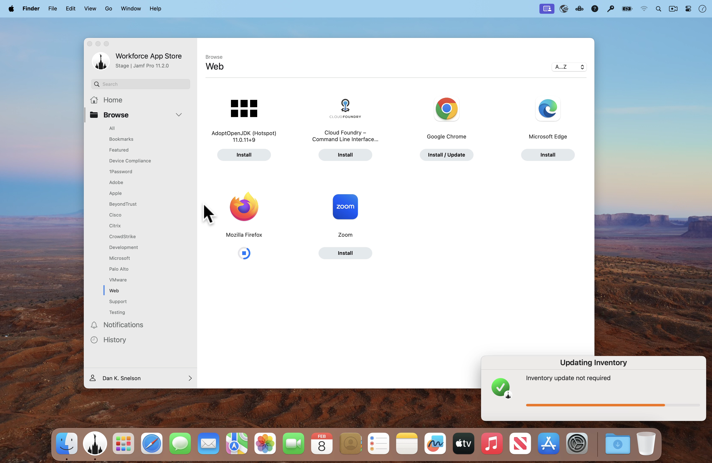

# Duration-triggered Inventory Update Progress with swiftDialog

> Provide your users more detailed feedback when updating inventory via Jamf Pro Self Service, at the duration **you** specify

## Background

### Fall 2022

In the fall of 2022, while conducting some internal training, one of our TSRs asked:

> “Is updating inventory where the blue circle just spins and spins but doesn’t appear to do anything?”
> 
> “Yes,” was my deflated reply.

Shortly thereafter, we implemented **Inventory Update Progress with swiftDialog**.

Later that same year, we introduced **Jamf Pro Self Service racing stripes when using Installomator with swiftDialog**.

All was right with the world.

### Groundhog Day 2024

Fast-forward to Groundhog Day of 2024, I logged into a test Mac mini to update its OS and was greeted by not _one_, not _two_, not _four_, but **three** pending updates:

1. Mozilla Firefox
1. Google Chrome
1. Adobe Acrobat Reader

I watched as **inventory** was needlessly submitted **after each and every update**, _just like I told it to_.

> Hopefully after implementing this approach, you’ll never have to be asked the above question or excessively update inventory again.

[Continue reading …](https://snelson.us/2024/02/duration-triggered-inventory-update-progress-with-swiftdialog/)

## Script

> :fire: **Breaking Change** for users prior to `0.0.7` :fire:
> 
> Version `0.0.7` modifies the Script Parameter Label for `scriptLog` — changing it to a hard-coded variable in the script (as it should have been all along) — Sorry for any Dan-induced headaches.

- [swiftDialog-Inventory-Update-Progress.zsh](swiftDialog-Inventory-Update-Progress.zsh)