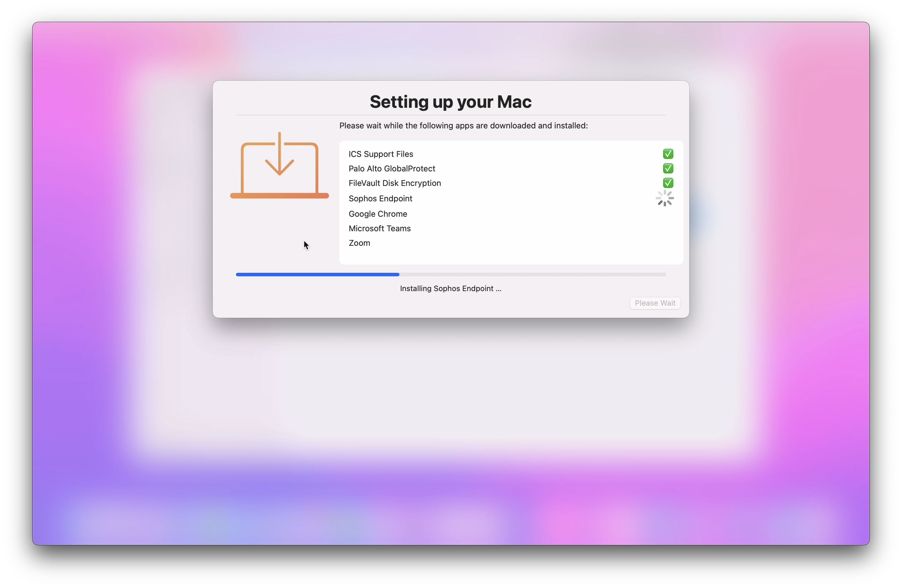

# Setup Your Mac via Dialog

Leverages [Dialog](https://github.com/bartreardon/Dialog/releases) v1.10.1 (or later) and Jamf Pro Policy [Custom Events](https://docs.jamf.com/10.36.0/jamf-pro/documentation/Policy_Management.html?hl=custom%2Cevent#ID-0001f43f) to allow end-users to self-complete Mac setup post-enrollment via Jamf Pro's Self Service. (See Jamf Pro Known Issues PI100009 - PI-004775.)

Inspired by:
- Rich Trouton (@rtrouton)
- Bart Reardon (@bartreardon)
- James Smith (@smithjw)

Based on:
- Adam Codega (@adamcodega)'s [MDMAppsDeploy.sh](https://github.com/acodega/dialog-scripts/blob/main/MDMAppsDeploy.sh)

---

## Screencast

