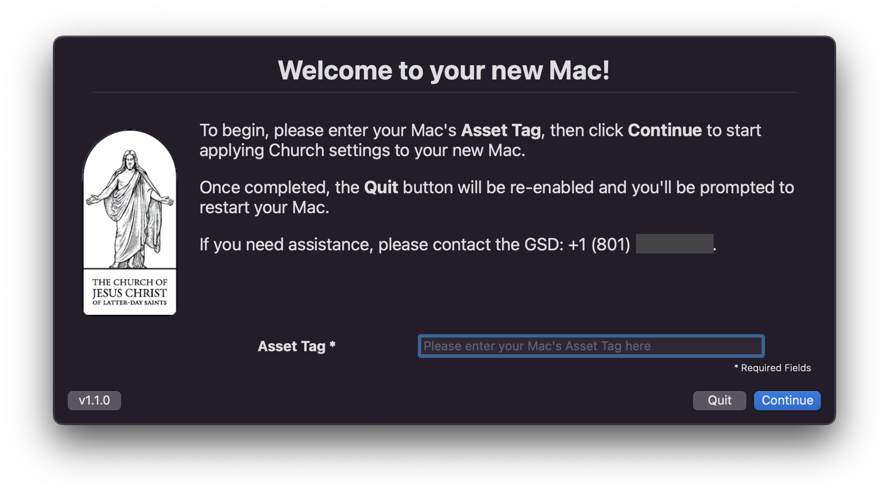
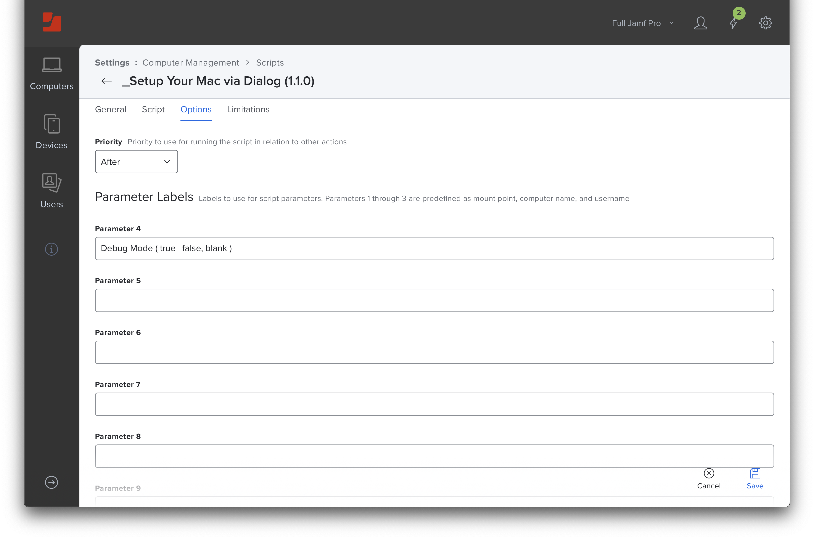

# Setup Your Mac via swiftDialog

> Leverages [swiftDialog](https://github.com/bartreardon/swiftDialog/releases) v1.10.1 (or later) and Jamf Pro Policy [Custom Events](https://docs.jamf.com/10.36.0/jamf-pro/documentation/Policy_Management.html?hl=custom%2Cevent#ID-0001f43f) to allow end-users to self-complete Mac setup **post-enrollment** via Jamf Pro's Self Service. (See Jamf Pro Known Issues `PI100009 - PI-004775`.)

Inspired by:
- Rich Trouton ([@rtrouton](https://github.com/rtrouton))
- Bart Reardon ([@bartreardon](https://github.com/bartreardon))
- James Smith ([@smithjw](https://github.com/smithjw))

Based on:
- Adam Codega ([@adamcodega](https://github.com/acodega))'s [MDMAppsDeploy.sh](https://github.com/acodega/dialog-scripts/blob/main/MDMAppsDeploy.sh)

---

## Screencasts

### Setup Your Mac

[](https://rumble.com/v15fwvl-setup-your-mac-via-swiftdialog-1.1.0.html)

### Harvesting Self Service Icons

[](https://rumble.com/v119x6y-harvesting-self-service-icons.html)

---

## Features

### Asset Tag Capture

Version `1.1.0` prompts the user to provide an Asset Tag, which is captured and reported in the **Setting up your Mac** screen and submitted near the end of the scipt when inventory is updated via `jamf recon -assetTag ${assetTag}`.


 ### Debug Mode

Version `1.1.0` introduces **Debug Mode**, which may prove helpful during initial deployment or for ongoing troubleshooting.

When Debug Mode is set to `true` — and only `true` — you will observe the following behavior changes:
- The `--title` in the **Setting up your Mac** screen will be preceeded by **DEBUG MODE |**
- Jamf Pro policies will **not** execute, but will output to the Jamf Pro Policy Log what _would_ have executed had Debug Mode not been set to `true`
- Computer inventory will **not** be updated, but will output to the Jamf Pro Policy Log what _would_ have been submitted (i.e., user-entered Asset Tag)

**Note:** When Debug Mode is set to `true`, you should expect to observe multiple failures in the **Setting up your Mac** screen as the policies which install the so-called `filepath for validation` don't actually execute.


---

## Configuration

You should be comfortable _modifying_ scripts before using this approach (i.e., customizing existing settings to your needs).

If the core functionality of this script meets your needs, **writing** code should not be required.

### Script Modifications

#### `apps` Variable

For each configuration step, enter a pipe-separated list of:
- Display Name
- Filepath for validation
- Jamf Pro Policy Custom Event Name
- [Icon hash](https://rumble.com/v119x6y-harvesting-self-service-icons.html)

##### Example

```
apps=(
    "FileVault Disk Encryption|/Library/Preferences/com.apple.fdesetup.plist|filevault|f9ba35bd55488783456d64ec73372f029560531ca10dfa0e8154a46d7732b913"
    "Sophos Endpoint|/Applications/Sophos/Sophos Endpoint.app|sophosEndpoint|c70f1acf8c96b99568fec83e165d2a534d111b0510fb561a283d32aa5b01c60c"
    "Palo Alto GlobalProtect|/Applications/GlobalProtect.app|globalProtect|fcccf5d72ad9a4f6d3a4d780dcd8385378a0a8fd18e8c33ad32326f5bd53cca0"
    "Google Chrome|/Applications/Google Chrome.app|googleChrome|12d3d198f40ab2ac237cff3b5cb05b09f7f26966d6dffba780e4d4e5325cc701"
    "Microsoft Teams|/Applications/Microsoft Teams.app|microsoftTeams|dcb65709dba6cffa90a5eeaa54cb548d5ecc3b051f39feadd39e02744f37c19e"
    "Zoom|/Applications/zoom.us.app|zoom|92b8d3c448e7d773457532f0478a428a0662f694fbbfc6cb69e1fab5ff106d97"
)
```

### Jamf Pro Script Options



> Labels to use for script parameters. Parameters 1 through 3 are predefined as mount point, computer name, and username

- **Parameter 4:** `Debug Mode ( true | false, blank)`

### Jamf Pro Policy Script Payload


- **Debug Mode:** `true` to enable Debug Mode; _anything else_ to disable

