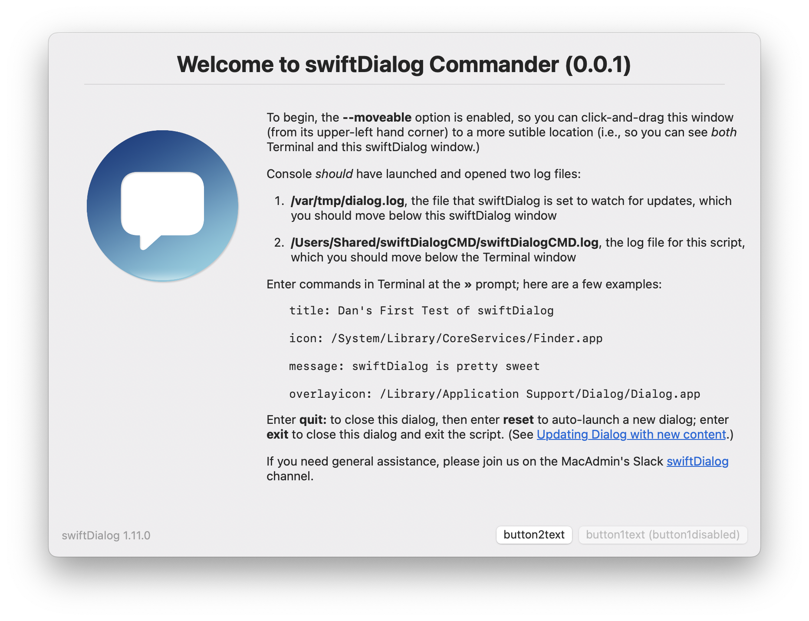

# swiftDialog Commander

> Interactive control of [swiftDialog](https://github.com/bartreardon/swiftDialog/releases) v1.11.0.2758 (or later) via the macOS Terminal

---

## Background

One of my favorite features of swiftDialog is [updating a running dialog with new content](https://github.com/bartreardon/swiftDialog/wiki/Updating-Dialog-with-new-content--\(v1.9.0).

To better wrap my head around how this works, I wrote `swiftDialog Commander` both as an exercise to test various commands and to help make sure I understood what was happening in scripts written by other Mac Admins.

---

## Screencast

[](https://rumble.com/v171h8u-swiftdialog-commander-0.0.1.html)

---

## Features

- Interactive control of a running dialog via the macOS Terminal

---

## Usage

1. Install the latest version of [switftDialog](https://github.com/bartreardon/swiftDialog/releases) on a local test Mac 
2. Save [swiftDialogCommander.sh](https://raw.githubusercontent.com/dan-snelson/dialog-scripts/main/swiftDialog%20Commander/swiftDialogCommander.sh) to your Downloads folder:
```console
curl -o ~/Downloads/swiftDialogCommander.sh https://raw.githubusercontent.com/dan-snelson/dialog-scripts/main/swiftDialog%20Commander/swiftDialogCommander.sh
```
3. Review the built-in help via: `bash ~/Downloads/swiftDialogCommander.sh --help`
4. Execute various commands via: `bash ~/Downloads/swiftDialogCommander.sh`
> `title: Title goes here`

> `icon: /System/Library/CoreServices/Finder.app`

> `message: Message goes here`

> `overlayicon: /Library/Application Support/Dialog/Dialog.app`