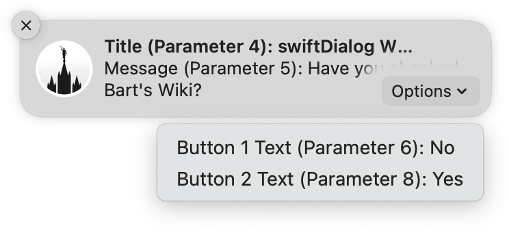

# Actionable Notifications via swiftDialog (2.4.0)

> A pair of scripts to help Jamf Pro admins easily display custom branded macOS Notifications 

## Background

One of the more welcome features of swiftDialog 2.4.0 is actionable macOS Notifications and when combined with Script Parameters, Jamf Pro administrators can easily display custom-branded, actionable macOS Notifications to their users.

[Continue reading …](https://snelson.us/)

---

### Scripts

> :fire: **Breaking Change** for users prior to `0.0.4` :fire:
> 
> Version `0.0.4` modifies the Script Parameter Label for `scriptLog` — changing it to a hard-coded variable in the script (as it should have been all along) — Sorry for any Dan-induced confusion.
> 
> Additionally, the Script Parameter for `subtitle` has been removed.

- [swiftDialog Pre-install.bash](swiftDialog%20Pre-install.bash)
- [swiftDialog Notifications.bash](swiftDialog%20Notifications.bash)